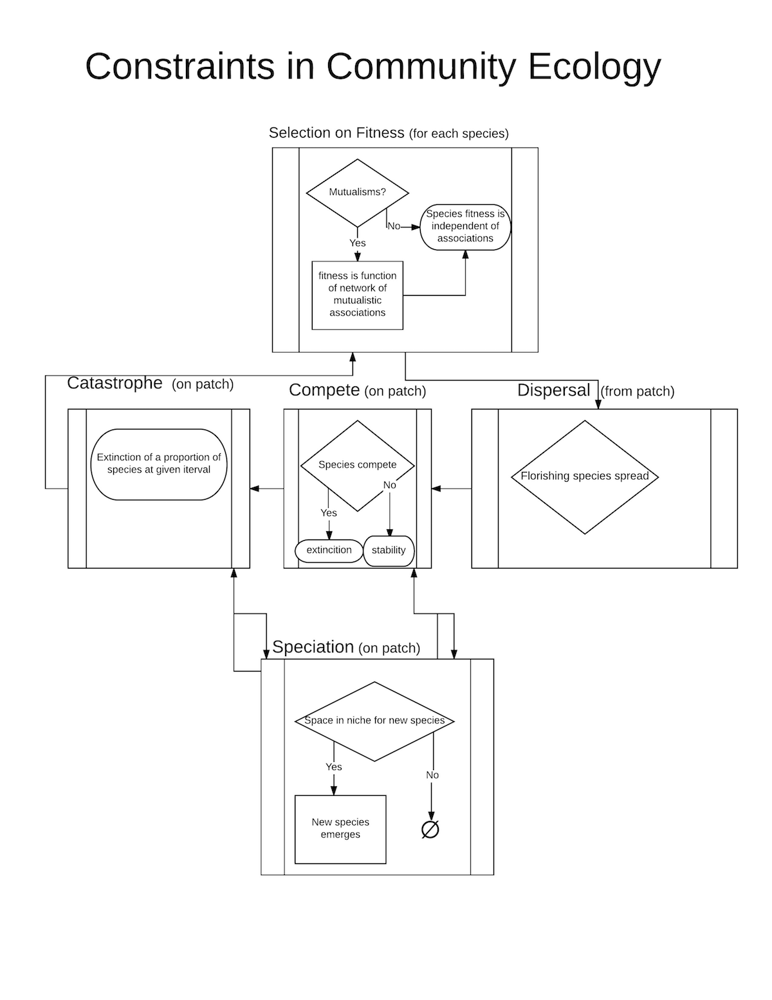

# Variables we care about most

## Independent variables (constraints)

- **`create_networkyn?`**
- **`selectyn?`**
- **`disperseyn?`**
- **`competeyn?`**
- **`catastropheyn?`**
- **`selectforDyn?`**

## Independent variables (others)

- **`numlink`**
- **`cdis1`**
- **`frqmod`**
- **`percent_species_to_wipeout`**
- **`var_fitness`**
- **`pp`**
- **`max_initial_proportion_links`**
- **`maxsp`**

## Dependent variables

- **`landscape.fitness.mean`**
- **`landscape.fitness.linked`**
- **`landscape.fitness.unlinked`**
- **`cluster.fitness.mean`**
- **`landscape.fitness.linked_unlinked.difference`**
- **`cluster-fitness.linked_unlinked.difference`**
- **`cluster.linked_unlinked_species.number.mean.difference`**
- **`landscape.linked_species.deaths.mean`**
- **`landscape.unlinked_species.deaths.mean`**
- **`landscape.linked_species.mean.turnover`**
- **`landscape.unlinked_species.mean.turnover`**
- **`avg_evennessT`**
- **`avg_evennessL`**
- **`avg_evennessU`**
- **`avg_InterpEven`**
- **`count_links`**
- **`count_species`**

# Simulation

## Purpose

This model has been designed to test how specially defined ecological communities maintain stability even in the presence of stochastic turnover. Using Vellend's (Vellend 2016) proposed set of high-level processes for conceptually framing ecological communities, i.e., selection, species drift, speciation, and dispersal, we hypothesize that these provide constraint closure in the way proposed by Moreno and Mossio (Moreno and Mossio 2015) that contribute to biological autonomy. Moreover we hypothesize specifically that these will allow stable ecological signatures to arise and be maintained through constraint closure. In this way we seek to exemplify the possibility of creating some measure of generalizability in ecosystem community structure. 

## Entities, state variables, and scales

The model is structured on a spatial torridal grid composed of NxN patches that form clusters of suitable and unsuitable areas. The unsuitable habitat patches form a barrier to, or retardation of, migration. Each habitat patch represents a packed set of niches that can hold M Species. Each patch contains an environmental niche score, a variable representing a habitat suitability index chosen from a uniform random distribution between 0 and 1. Each species has a similar niche score, which represents a one-dimensional niche measure of the species’ needs. This corresponds to the patch environmental niche score, which in tern is a measure of what needs that habitat will provide. A species’ fitness will be defined as the absolute distance between a species niche score and this patch’s environmental niche score. 

Some species are able to form mutualisms with other species and a directed network is established between k <= M species. The fitness of a linked species, differs from unlinked species and is calculated as a given function of linked species in a given patch, e.g., the maximum or average fitness of the linked species. 	

The specific constraints thought to allow the creation of stable communities are (a) Selection; (b) Dispersal; (c) mutualism (with any eye to mycorrhizal symbiotic relationships); (d) Spatial Competition; and (e) Fitness Competition between linked and unlinked species.  In addition there are two assumed constraints that are structural parts of the model and are not tested for effect in this stage of the model analysis but may be explored at a latter time. (a) niche packing, i.e., a finite niche space; and (b) spatial structure limiting dispersal among species.  

## Process Overview and Scheduling

After establishing the grid (details below in initialization section), M species are created in each patch i. A given number K, are able to form mutualistic links, the rest, M-K, are not. Each time step, τ, represents the mean time a species is likely to exist in a community. At time, τ_l, k, mutualistic links are established within the patch for the initial population of species in each patch where k=Kρ. K is the maximum number of links that can be established, and ρ is a random variable that gives the proportion of potential links that do get established for a given K. The following processes procedures are given in the order they are executed. 

- **Select**: Fitness is calculated based on the absolute distance of a given species’ niche score to the patch’s environmental niche score. For linked species the fitness is the highest fitness among those species with which it is linked. The species with the lowest fitness on each patch is eliminated. 

- **Dispersal**: The species with the very highest fitness spreads to one of its neighbors if it has an opening, i.e., one of its neighbor patches has fewer than M species. If it is a species that can form links in its new patch it will do so. 

- **Fitness competition**: One of the linkable species and one of the unlinkable species is randomly selected within each patch. The one with the higher fitness reproduces, the one with the lower fitness goes extinct in the patch. 

- **Speciation**: Whenever there are G <= M  openings in the niches within a patch, G new species are created from the G species with the highest fitnesses. The new species will have a  niche score with the same mean fitness as its parent's fitness value, but with variance ν. 
	
- **Catastrophes**: At given intervals, I ∈{1,t_max} a proportion, φ, of the M species in each patch can be randomly wiped out. These perturbations provide a test of stability in terms of how the patch recovers from its loss of species. 
  

## Design concepts

- **Emergence**: We expect stability to emerge from certain combinations of constraints which form a closed loop of interaction and create constraint closure among the ecological processes described above. 

- **Objectives**: We will run the model under a number of different parameter combinations to understand how stability is structured and under what conditions of perturbation it is maintained. 

- **Interactions**: Among species-agents in the model, interactions can be positive among those forming mutualistic associations, and negative among those that compete. 

- **Stochasticity**: Stochasticity enters into the model in several places. (a) The initial patch structure of the landscape is randomly generated; (b) The proportion of species chosen to actually form links, ρ is a random variable; (c) the species that go extinct in the drift stage are randomly chosen with probability proportional to fitness; species with high fitness chosen to move, move randomly to one of their 8, Moore-neighborhood neighbors; (d) The variation of fitness around newly spectated species is a random variable ν; and initially the environmental variable and the species environmental needs variable are randomly chosen; and (e) Species eliminated in a catastrophe are randomly chosen. 

- **Variables of Interest**: Turnover rate: The turnover rate is the number of new species created at each time step. The way the model is formulation new species arise when there is an opening in relation to the packed niche. This happens in competition between the linked and unlinked species, in selection events in which the least fit species is selected for elimination, and in perturbation events. 

## Initialization

Initialization consists of a random landscape being produced using two variables that control the number of patches selected and the distribution of patches. Figure xx gives an example of one of the landscapes produced. This procedure is based upon xxxx.

## Testing

The model Behavior Space in NetLogo was used to test the overall behavior of the model.  A complete iteration set of the binary switches turning on and off the constraint submodels and for three values of the possible number of links per species and two values of different landscape types leading to 144 possible combinations which compromise the permutation set used to explore the constraint space, with T=500 timesteps for each sample from the model hyperspace. A uniform random distribution of the variables propform, varfitness, frqmod, and perwipe, were drawn from the 150 iterations of each of the possible constraint permutation set for each of the These were taken with replacement over the multidimensional parameter space.  Mixed model analyses (details are found in  Supplemental Materials ) were used to explore the influence of each of the parameters thought to be of interest. The results of these analyses need a cautionary warning. As White et al. (2014) {White, 2014 #58} note, these results should not be interpreted as a test of statistical significance of each of the parameter set as the likelihood values and statistical tests are easily influenced by the number of iterations used in the model testing. Therefore they were used as a heuristic to chose the set of parameters that might be averaged or representative values chosen that do not influence how the constraints inform the results of the model.

In all of the model selection analyses, the constraint variables were retained in parameters related to fitness and as expected. For dependent variables involving fitness the full model was usually needed to explain the variation. Exceptions include for within cluster measures of fitness. The variation in turnover rates were explained by the full set of constraints and by the frequency of perturbation and the intensity of the perturbation.  This provides evidence that the model’s variable and parameter set are adequate. 

## Flow

# Variables and their roles

## Global variables (independent; fixed)

- **`maxticks`**: Number of time steps to run model (time step is average species time in patch until extinction--Global used throughout)
- **`Maxsptot`**: The maximum number of species in plot--Used by set up.
- **`create_networkyn?`**: binary determines if a mutualistic network is created. **CONSTRAINT**
- **`selectyn?`**: binary, determines if selection is included in the runs **CONSTRAINT**
- **`disperseyn?`**: binary, determines if dispersal is used in the model **CONSTRAINT**
- **`competeyn?`**: binary, determines if competition between networked and non-networked species are used in the model. **CONSTRAINT**
- **`selectforyn?`**: binary, determines if most fit species are moved into patch if their is and unoccupied niche in the patch **CONSTRAINT**
- **`catastropheyn?`**: binary, determines if catastrophes are included in the model **CONSTRAINT**
- **`numlink`**: number of links each species can form with other species
- **`max_intial_proportion_links`**: proportion of maximum number of links in initial establishment of links 
- **`cdis1`**: used in clustering algorithm to influence distribution of patches and clusters
- **`cdis2`**: used in clustering algorithm to influence distribution of patches and clusters
- **`frqmod`**: frequency of catastrophes 
- **`percent_species_to_wipeout`**: percent of species wiped out in catastrophes 
- **`var_fitness`**: variation in offspring's inheritance of fitness value from parents (used in procedure-speciation). 
- **`pp`**: parameter in establishing clusters that give some proportion of good habitat set to .25 now

## Patch variables (independent; fixed)

- **`envir`**: the environment of the patch
- **`cluster`**: cluster is patch which defines cluster
- **`bad_cluster`**: used in cluster formation
- **`clusternum`**: numerical designation for cluster
- **`bad_clusternum`**: used in cluster formation
- **`pinclus`**: number of patches in your clustermaxtotsp
- **`propmaxrat`**: relative size of cluster compared to largest cluster

## Patch variables (dependent)

- **`num_species_here`**: number of species here
- **`num_speices_linked_here`**: number of linked species
- **`max_num_species`**: maxnum of species here
- **`numdieU`**: number of unlinked species in patch that have died
- **`numdieL`**: number of unlinked species in patch that have died
- **`numdieR`**: number of species killed in catastrophe
- **`turnoverrate`**: turnover rate in patch
- **`turnoverrateL`**: turnover rate of linked species in patch
- **`turnoverrateU`**: turnover rate of unlinked species in patch
- **`lagspecies`**: agentset with species here last time
- **`lagspeciesL`**: agentset with species here last time
- **`lagspeciesU`**: agentset with species here last time

## Species variables (independent)

- **`sp_num`**: species number
- **`max_links_I_can_have`**: individual number of links a species can form
- **`num_my_links`**: number of links I have
- **`inv_fitness`**: probability of extinction
- **`envir_need`**: environment preferred

## Reporters (possible dependent variables)

- **`patch.habitat.percent`**:   : The percent of good patches out of total number of patches
- **`patch.habitat.count`**:    : The total number of habitat patches
- **`species.number.turnover`**:  : This is a surrogate for turnover--Why? Because at new species are assigned at new species number based on +1 that last species. The sum of all species divided by the number of species gives a measure of how many new species there are.
- **`species.number.turnover.difference`**:  : Gives the sum of species numbers minus the last time, or basically the change in species number for each time step
- **`species.number.stdiv`**:  : gives the standard deviation of the species, i.e, how much variation there is in species numbers-- Low means that all patches are turning over species at a similar rate -- high means patches turnover rate is more variable.
- **`patches.species.withlinks.count`**:  : The number of patches with any links
- **`landscape.fitness.mean`**:  : The global fitness across all patches
- **`landscape.fitness.var`**:  : variance in global fitness
- **`cluster.fitness.mean`**:  : the adverage mean culster fitness averaged across region
- **`cluster.fitness.var`**: the variance among mean cluster fitness across the region
- **`cluster.linked.var`**: varance in number of linked species among clusters
- **`cluster.unlinked.var`**: varance in number of unlinked species among clusters
- **`cluster.linked_unlinked.var.difference`**: Difference in varince between unlinked and linked species
- **`landscape.fitness.linked_unlinked.difference`**: The difference in global fitness between linked and unlinked species
- **`cluster.fitness.linked_unlinked.difference`**: The difference in mean cluster fitness between linked and unlinked species : The cluster mean of species number of linked species
- **`cluster.linked_species.number.mean`**: The cluster mean of species number of linked species
- **`cluster.unlinked_species.number.mean`**: Cluster mean of species number in unlinked species
- **`cluster.linked_unlinked_species.number.mean.difference`**: Mean species number difference between linked and unlinked species 
- **`cluster.patches.links.mean`**: count mean number of patches with links averaged across clusters
- **`cluster.patches.unlinks.mean`**: count mean number of patches without links averaged across clusters
- **`landscape.species.number.var`**: The variance of species number over all species in landscape
- **`landscape.contagion`**: Contagen index from equation #22 Landscape Ecology vol. 8 no. 3 pp 155-162 (1993) 'A new contagion index to quantify spatial patterns of landscapes' by Habin Li and James F. Reynolds
- **`model.stop.reason`**: How the model ended endlich = 1 => model reached end of max runs; endlich = 2 => all speieces went extinct; endlich = 3 => links go to zero for thirty ticks; endlich = 4 => all paches have links.
- **`landscape.linked.actual_possible`**: The proportion of linked species out of total number of possible linked species if all linkable species were linked
- **`cluster.count`**: The number of clusters
- **`cluster.size.mean`**: mean cluster size 
- **`cluster.linked_species.deaths.mean`**: The cluster mean of the number of dead species in linked species.
- **`cluster.unlinked_species.deaths.mean`**: The cluster mean of the number of dead species in unlinked species.
- **`cluster.linked_species.random_deaths.mean`**: The cluster mean of the number of species killed randomly (those killed in a catastrophe)
- **`landscape.linked_species.deaths.mean`**: The number of linked species deaths in entire landscape 
- **`landscape.unlinked_species.deaths.mean`**: The number of unlinked species deaths in entire landscape 
- **`landscape.species.random_deaths`**: number of species killed randomly in landscape
- **`landscape.species.number_per_patch.mean`**: number of species per patch in landscape
- **`landscape.linked_species.number_per_patch.mean`**: number of linked species per patch in landscape
- **`cluster.linked_species.fitness.mean`**: The cluster mean of species fitness of linked species
- **`cluster.unlinked_species.fitness.mean`**: The cluster mean of species fitness of unlinked species
- **`cluster.linked_species.fitness.var`**: Mean variance in number of linked species per cluster 
- **`cluster.unlinked_species.fitness.var`**: Mean variance in number of unlinked species per cluster
- **`landscape.turnover.slope.run1`**: calculates the slope of the line that runs through turnover rate between `turnover_interval1` and `turnover_interval2` near beginning of runs
- **`landscape.turnover.slope.run2`**: calculates the slope of the line that runs through the turnover rate at end of runs
- **`landscape.turnover.YInter.run1`**: Calculates y intercept of line that runs through turnover rate between `turnover_interval1` and `turnover_interval2` near begining of runs
- **`landscape.turnover.YInter.run2`**: Calculates y intercept of line that runs through turnover rate near end of runs
- **`landscape.turnover.Rsquare.run1`**: Calculates R-square of of line that runs through turnover rate between `turnover_interval1` and `turnover_interval2` near begining of runs
- **`landscape.turnover.Rsquare.run2`**: Calculates R-square line that runs through turnover rate near end of runs 
- **`landscape.turnoverL.slope.run1`**: calculates the slope of the line that runs through turnover rate between `turnover_interval1` and `turnover_interval2` near begining of runs of linked species 
- **`landscape.turnoverL.slope.run2`**: caculates the slope ofthe line that runs through the turnover rate at end of runs of linked species 
- **`landscape.turnoverL.YInter.run1`**: Calculates y intercept of line that runs through turnover rate between `turnover_interval1` and `turnover_interval2` near begining of runs of linked species 
- **`landscape.turnoverL.YInter.run2`**: Calculates y intercept of line that runs through turnover rate near end of runs of linked species
- **`landscape.turnoverL.Rsquare.run1`**: Caculates R-sqaure of of line that runs through turnover rate between `turnover_interval1` and `turnover_interval2` near begining of runs of linked species 
- **`landscape.turnoverL.Rsquare.run2`**: Calculates R-square line that runs through turnover rate near end of runs of linked species
- **`landscape.turnoverU.slope.run1`**: calculates the slope of the line that runs through turnover rate between `turnover_interval1` and `turnover_interval2` near begining of runs of unlinked species 
- **`landscape.turnoverU.slope.run2`**:  caculates the slope ofthe line that runs through the turnover rate at end of runs of unlinked species 
- **`landscape.turnoverU.YInter.run1`**: Calculates y intercept of line that runs through turnover rate between `turnover_interval1` and `turnover_interval2` near begining of runs of unlinked species 
- **`landscape.turnoverU.YInter.run2`**: calculates y intercept of line that runs through turnover rate between `turnover_interval1` and `turnover_interval2` near begining of runs of unlinked species 
- **`landscape.turnoverU.Rsquare.run1`**: Caculates R-sqaure of of line that runs through turnover rate between `turnover_interval1` and `turnover_interval2` near begining of runs of unlinked species 
- **`landscape.turnoverU.Rsquare.run2`**: Calculates R-square line that runs through turnover rate near end of runs of unlinked species
- **`landscape.linked_species.mean.turnover`**: The global turnover of linked species across all patches
- **`landscape.unlinked_species.mean.turnover`**: The global turnover of unlinked species across all patches
- **`landscape.species.mean.turnover`**: The global turnover of species across all patches
- **`count_links`**: Total number of links
- **`count_species`**: Total number of species
